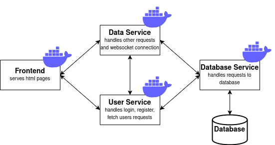

# From a monolith to microservices

In the course "Introduction to Full Stack Web Development" we had to create small web applications, consisting of frontend, backend, and database. Such technologies as Vue.js, REST API, WebSocket, and SQLite database were used for it. In the course, the whole project was implemented as a monolith application.

More precisely the web service represents a website for a tennis club. Members can be registered, tennis courts can be reserved and the watering system can be activated. SQLite was used for the database system.

To apply knowledge from the course "Cloud Computing", the web application will be transformed into a microservice architecture. The goal for this project is to split it up into multiple microservices which contain at least (but are not limited to):
- Database Service: offers an API to access the SQLite database.
- Users Service: responsible for user logins, currently active sessions, and user information for the administrator. It will use the API of the database service to gather this information.
- Data Service: delivers and saves information about reservations and the watering system. It will use the API of the database service to gather all necessary information.
- Web Service: delivers HTML, javascript, and CSS files to the user.

The services will run on docker containers, which will be deployed using Kubernetes. Additionally, a CI pipeline using GitHub actions will be built and tested.

Another goal of this project is to experiment with monitoring for microservices using the OpenTelemitry framework and visualize the resulting monitoring data using Jaeger.

## Structure

The structure description of this project will be split into microservice structure and deployment structure.

### Microservice structure

The overall architecture for the microservice communication looks as follows:

- The frontend of the web application uses HTML, CSS and Javascript as well as the VueJS framework.
- The content displayed on a page is fetched by a request to the corresponding microservice.
- The microservices are written in Javascript and run on NodeJS 16.
- The database service is responsible for retrieving data from the MySQL-database and forwards the data to a microservice.
- In order to handle multi-user access websockets are integrated as well.
- Requests between microservices are traced with opentelemitry and forwarded by a Jaeger collector (and Zipkin collector) to the monitoring services (Jaeger and Zipkin).

### Deployment structure

The deployment is structured as follows:

- For hosting the Kubernetes cluster, we use an Ubuntu server VM with minikube.
- The microservices are deployed as pods in a deployment that is accessed by a service.
- Each deployment pulls the newest image for a microservice from DockerHub.
- A change on the master branch will start a CI pipeline that creates docker images for each microservice and stores them on DockerHub.
- Deployment of new services in the Kubernetes cluster must be triggered manually (e.g. delete old pods).
- Access to microservices from outside is handled by an ingress controller, which distributes requests from the client to the microservices.
- The port of the ingress controller is exposed to the end user.
- The Jaeger container is also deployed in the Kubernetes cluster and accessed via a service (same for Zipkin, not shown in the picture).
- For testing purposes, the monitoring UI is directly exposed on the Host VM for access from the internet.
- To persist changes in the database, the database is stored on the Host VM and mounted into minikube. In minikube the database is then mounted into the databse pod.
- To keep the cluster running, we installed some services on the Host VM that maintain the database mount and port forwards.

## Summary of Research

## Tutorial

## Lessons-learned

- Conversion of a monolith webapp to multiple microservices offering the same functionality.
- Creation of correct dockerfiles for the microservices
- Automatic building of docker images and pushing on Dockerhub through a CI pipeline
- Integration of OpenTelemetry into the microservices
- Setting up Ingress to forward routes from the frontend to the correct microservice
- Setting up Minikube to execute the services on our local server
