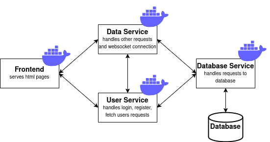
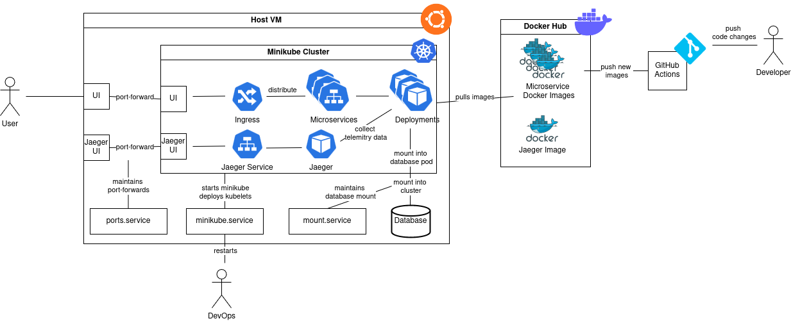

# Structure

The structure description of this project will be split into microservice structure and deployment structure.

## Microservice structure

The overall architecture for the microservice communication looks as follows:

- The frontend of the web application uses HTML, CSS and Javascript as well as the VueJS framework.
- The content displayed on a page is fetched by a request to the corresponding microservice.
- The microservices are written in Javascript and run on NodeJS 16.
- The database service is responsible for retrieving data from the SQLite-database and forwards the data to a microservice.
- In order to handle multi-user access websockets are integrated as well.
- Requests between microservices are traced with opentelemetry and forwarded by a Jaeger collector (and Zipkin collector) to the monitoring services (Jaeger and Zipkin).

## Deployment structure

The deployment is structured as follows:

- For hosting the Kubernetes cluster, we use an Ubuntu server VM (Ubuntu Server 24.04LTS) with minikube.
- The microservices are deployed as pods in a deployment that is accessed by a service.
- Each deployment pulls the newest image for a microservice from DockerHub.
- A change on the master branch will start a CI pipeline that creates docker images for each microservice and stores them on DockerHub.
- Deployment of new services in the Kubernetes cluster must be triggered manually (e.g. delete old pods).
- Access to microservices from outside is handled by an ingress controller, which distributes requests from the client to the microservices.
- The port of the ingress controller is exposed to the end user.
- The Jaeger container is also deployed in the Kubernetes cluster and accessed via a service (same for Zipkin, not shown in the picture).
- For testing purposes, the monitoring UI is directly exposed on the Host VM for access from the internet.
- To persist changes in the database, the database is stored on the Host VM and mounted into minikube. In minikube the database is then mounted into the database pod.
- To keep the cluster running, we installed some services on the Host VM that maintain the database mount and port forwards.
